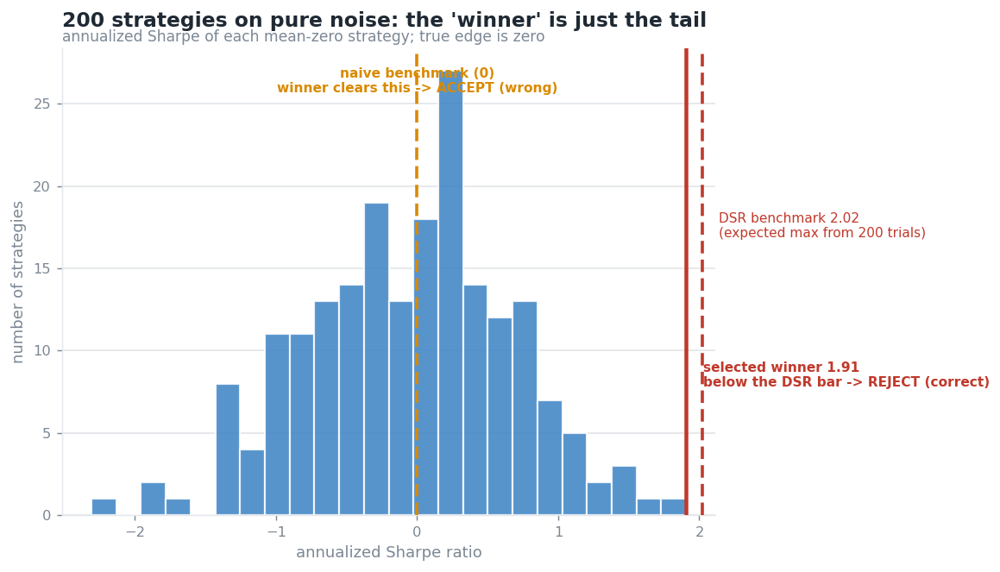

# SignalGuard

**A backtest validation harness that rejects overfit trading strategies — and the build plan
for the system it belongs to.**

[](../../actions/workflows/ci.yml)
[](requirements.txt)
[](LICENSE)

Most trading projects show one flattering equity curve. This one leads with the machinery
that *kills* a strategy that only looks good, because that is what separates someone who has
understood backtest overfitting from someone who has not.

> **The first deliverable is not a profitable strategy. It is a harness that can honestly
> reject one.**



*Search 200 pure-noise strategies and the best one "achieves" Sharpe 1.9. The Deflated Sharpe
Ratio knows how many trials you ran, and rejects it.*

## Run it

```bash
pip install -r requirements.txt
cd demo && python3 gate_demo.py
```

Real output — the same gate, on a strategy built to be overfit and on a clean one:

```
#  Scenario 1: an overfitting artifact (should be REJECTED)
SignalGuard validation gate
  [FAIL] deflated_sharpe   DSR 0.44 < 0.95  (edge indistinguishable from 200-trial noise)
  [FAIL] lookahead_audit   same-bar/next-bar gap +20.88  (books the bar it traded on)
  [FAIL] purged_cv         purged 0.50 at baseline, leak +0.10  (score was leakage)
  [FAIL] walk_forward      WFE -0.14 < 0.5  (IS +0.91 -> OOS -0.13, edge did not survive)
  VERDICT: REJECT (4/4 checks failed)

#  Scenario 2: a clean strategy (should be ACCEPTED)
SignalGuard validation gate
  [PASS] deflated_sharpe   DSR 1.00 >= 0.95  (survives 3-trial deflation)
  [SKIP] lookahead_audit   no price series supplied; cannot audit fill timing
  [PASS] purged_cv         purged 0.62, leak +0.01  (no material leakage)
  [PASS] walk_forward      WFE 0.72 >= 0.5  (IS +0.74 -> OOS +0.54)
  VERDICT: ACCEPT (3/3 checks passed)
```

`python3 run_all.py` runs every demo, all 27 tests, and regenerates every chart.

## What it catches

Four independent overfitting failure modes, each a self-contained demo with its own tests.
numpy for the logic, deterministic, no market data or broker required.

| Check | The failure mode it catches | Result |
|---|---|---|
| [`deflated_sharpe_demo.py`](demo/deflated_sharpe_demo.py) | Selection bias from searching many strategies | Best-of-200 noise "finds" 1.9 Sharpe → **rejected**, while a real edge still passes |
| [`purged_cv_demo.py`](demo/purged_cv_demo.py) | Label leakage across overlapping samples | Shuffled k-fold reads 0.60 accuracy → purge + embargo collapses it to the honest **0.50** |
| [`lookahead_detector_demo.py`](demo/lookahead_detector_demo.py) | Filling on the bar you decided from | A same-bar peek prints **+20 Sharpe from zero edge**; two detectors catch it |
| [`walk_forward_demo.py`](demo/walk_forward_demo.py) | In-sample fit that doesn't survive | IS +0.87 → OOS +0.16, **walk-forward efficiency 0.18** |

## How the gate is built

[`demo/gate.py`](demo/gate.py) composes the four checks into one verdict. Two design
decisions carry most of the weight:

- **Silence is not consent.** A check missing its inputs returns `SKIP`, never a quiet
  `PASS`. `ACCEPT` requires at least one check to have actually run.
- **An undefined score is a `FAIL`, not a skip.** If a metric can't be computed, that is
  evidence against the strategy, not absence of evidence.

The single highest-value test is the paired check that the same noise strategy is **rejected
at its true trial count (N=200) and accepted at an understated one (N=5)** — which proves
both that the harness works and why the trial counter has to be tamper-evident.

## Delivered vs. planned

| | Status |
|---|---|
| Validation harness — 4 checks, 1 composing gate, 27 tests, CI on 3 Python versions | ✅ **done, runnable** |
| Validated against 155 years of S&P 500 data ([`real_data_gate.py`](demo/real_data_gate.py)) | ✅ **done** |
| The trading system itself — data pipeline, execution, risk, live | 📐 **specified to the file level, not built** |

Phases, gates, and effort budgets are in [`PLAN.md`](PLAN.md). This is deliberately ordered:
the harness that can reject a strategy comes before any strategy.

## The engineering record

[`DECISIONS.md`](DECISIONS.md) is an append-only log of what was decided, what was rejected,
and which claims are `[verified]` versus `[inference]`. **Five decisions in it were overturned
by adversarial review** — including the original instrument choice, after the arithmetic
showed MNQ sits outside a defensible risk band even intraday.

That log, not the code, is the part that took judgment.

## Three things that govern the design

**1. One code path for backtest and live.** The strategy consumes an abstract event
interface; backtest and live differ only by which `DataFeed`, `ExecutionHandler`, and `Clock`
are injected. Divergent codebases drift and then lie to you.

**2. Realistic net Sharpe is 0.5–1.0. Anything above ~2.0 backtested is a bug report.**
On a 4-year window the noise ceiling for even a small honest search is ~0.90–1.22 — *above*
the entire realistic target band. So validation runs on the longest available history, and
the trial budget is capped before looking.

**3. Costs are a hard constraint on strategy shape.** At $2.90 all-in per round turn, a
10%-of-equity annual cost ceiling permits ~275 round turns/year ≈ 1.09 per trading day. That
kills every multi-entry intraday design before a line is written.

## Repo map

| Path | What it is |
|---|---|
| [`demo/`](demo/) | The harness. 18 Python files, 27 tests, 4 charts. |
| [`DECISIONS.md`](DECISIONS.md) | Append-only decision log. The reasoning record. |
| [`PLAN.md`](PLAN.md) | Phases 0–5 with gates, budgets, and explicit skip lists. |
| [`docs/constitution.md`](docs/constitution.md) | Standing domain rules §2–§9: instrument, data, broker, risk. |
| [`CLAUDE.md`](CLAUDE.md) + [`docs/PROMPTING.md`](docs/PROMPTING.md) | Agent tooling — the layered context system used to build this. Not part of the product. |
| [`docs/`](docs/) | Module designs, observability design, curated research syntheses. |

## Honest framing

At under $10k, a genuine Sharpe 0.5 is roughly **+$700/yr with a ~$2,400 (30%) drawdown en
route**, and confirming a true Sharpe of 0.5 takes on the order of 15 years of data.
**Profitability at this capital is proof-of-concept, not income.** The engineering and the
falsification record are the durable assets — and they survive the strategy not working.

## License

Apache-2.0. Copyright 2026 Victoria Chang. See [`LICENSE`](LICENSE) and [`NOTICE`](NOTICE).
