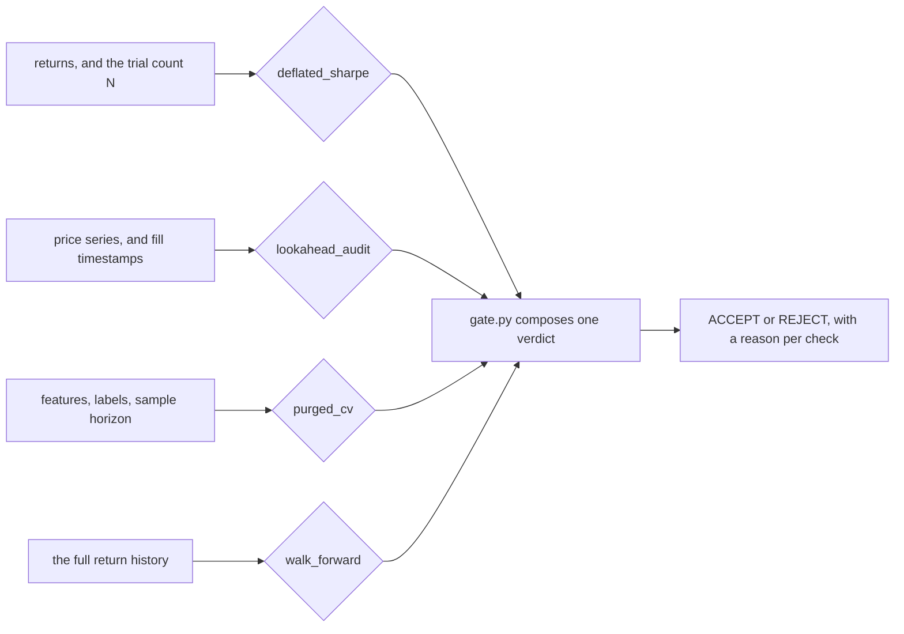

# SignalGuard

**A backtest validation harness that rejects overfit trading strategies, and the build plan
for the system it belongs to.**

[](../../actions/workflows/ci.yml)
[](requirements.txt)
[](LICENSE)

A backtest that only looks good is the normal outcome of searching, not a rare failure.
This repo leads with the machinery that kills one.

> **The first deliverable is not a profitable strategy. It is a harness that can honestly
> reject one.**


*Search 200 pure-noise strategies and the best one "achieves" Sharpe 1.9. The Deflated Sharpe
Ratio knows how many trials you ran, and rejects it.*

## The problem

A backtest is a search. Try enough strategies against the same history and one of them will
post a great Sharpe for the same reason one of a thousand coin-flippers gets ten heads, and
the backtest reports that number with no memory of how many candidates it rejected to find
it. Every standard failure here has the same shape: the result is real, the *inference* from
it is not. Selection bias, label leakage across overlapping samples, filling on the bar you
decided from, and a fit that doesn't outlive its sample all produce a curve that goes up and
tells you nothing.

SignalGuard is the gate that stands between a backtest and belief in it. It takes a
strategy's returns and the search that produced them, and returns `ACCEPT`, `REJECT`, or
`SKIP` with a reason.

## Install

Python 3.9, 3.11, and 3.12 are tested in CI. Core logic and tests need only numpy;
matplotlib is used solely to regenerate charts.

```bash
git clone https://github.com/vzchang/signalguard.git
cd signalguard
pip install -r requirements.txt
```

## Run it

```bash
cd harness && python3 gate_demo.py
```

Real output from the same gate, on a strategy built to be overfit and on a clean one:

```
#  Scenario 1: an overfitting artifact (should be REJECTED)
SignalGuard validation gate
  [FAIL] deflated_sharpe   DSR 0.44 < 0.95  (edge indistinguishable from 200-trial noise)
  [FAIL] lookahead_audit   same-bar/next-bar gap +20.88  (books the bar it traded on)
  [FAIL] purged_cv         purged 0.50 at baseline, leak +0.10  (score was leakage)
  [FAIL] walk_forward      WFE -0.14 < 0.5  (IS +0.91 -> OOS -0.13, edge did not survive)
  VERDICT: REJECT (4/4 checks failed)

#  Scenario 2: a clean strategy (should be ACCEPTED)
SignalGuard validation gate
  [PASS] deflated_sharpe   DSR 1.00 >= 0.95  (survives 3-trial deflation)
  [SKIP] lookahead_audit   no price series supplied; cannot audit fill timing
  [PASS] purged_cv         purged 0.62, leak +0.01  (no material leakage)
  [PASS] walk_forward      WFE 0.72 >= 0.5  (IS +0.74 -> OOS +0.54)
  VERDICT: ACCEPT (3/3 checks passed)
```

`python3 run_all.py` runs every demo, all 27 tests, and regenerates every chart in one
pass. The tests are plain asserts so the suite has no dependency beyond numpy, but they are
written as `test_*` functions and run under pytest unmodified:

```bash
cd harness && python3 -m pytest -q      # 27 passed
ruff check .                         # from the repo root
```

## What it catches

Four independent overfitting failure modes, each a self-contained demo with its own tests.
numpy for the logic, deterministic, no market data or broker required.

| Check | The failure mode it catches | Result |
|---|---|---|
| [`deflated_sharpe.py`](harness/deflated_sharpe.py) | Selection bias from searching many strategies | Best-of-200 noise "finds" 1.9 Sharpe → **rejected**, while a real edge still passes |
| [`purged_cv.py`](harness/purged_cv.py) | Label leakage across overlapping samples | Shuffled k-fold reads 0.60 accuracy → purge + embargo collapses it to the honest **0.50** |
| [`lookahead_detector.py`](harness/lookahead_detector.py) | Filling on the bar you decided from | A same-bar peek prints **+20 Sharpe from zero edge**; two detectors catch it |
| [`walk_forward.py`](harness/walk_forward.py) | In-sample fit that doesn't survive | IS +0.87 → OOS +0.16, **walk-forward efficiency 0.18** |

## Why the 1.9 Sharpe matters

Those 200 strategies have **no edge at all**. They
are trading pure noise, and their true expected Sharpe is zero. Search them, keep the best,
and the winner reports 1.9.

Two things follow, and they are why the rest of the repo is shaped the way it is:

1. **1.9 is not an implausible backtest result. It is a typical one.** A realistic net Sharpe
   for a retail futures strategy is 0.5 to 1.0. A search that produces 1.9 out of nothing
   produces a number *twice as good as anything honest*, so a backtest that looks too good
   is evidence about the search, not the strategy. This is why the repo treats anything above
   ~2.0 as a defect report.
2. **The strategy alone cannot tell you.** Sharpe 1.9 from noise and Sharpe 1.9 from a real
   edge are identical if all you have is the return series. What distinguishes them is `N`: how
   many candidates were tried. The Deflated Sharpe Ratio takes `N` as an input and asks
   whether the best of `N` draws would look this good by chance. At N=200 it rejects; at N=5
   the *same returns* pass.

That last sentence is the load-bearing test in the suite, and it cuts both ways: the harness
only works if the trial count is honest. So `N` cannot be a number someone types at the end.
The planned system makes it a tamper-evident counter incremented as trials run, a ledger of
run manifests rather than an integer, with the trial budget capped before any fitting
begins. That ledger is designed but not built; the harness here takes `N` as an argument.

## How the validation pipeline works



Each check is independent, takes its own inputs, and returns `PASS`, `FAIL`, or `SKIP`.
[`harness/gate.py`](harness/gate.py) composes them into one verdict. Two design decisions carry
most of the weight:

- **Silence is not consent.** A check missing its inputs returns `SKIP`, never a quiet
  `PASS`. `ACCEPT` requires at least one check to have actually run.
- **An undefined score is a `FAIL`, not a skip.** If a metric can't be computed, that is
  evidence against the strategy, not absence of evidence.

One test pairs the two directions: the same noise strategy is **rejected at its true trial
count (N=200) and accepted at an understated one (N=5)**. That covers both the harness
working and the reason the trial counter has to be tamper-evident.

## Delivered vs. planned

| | Status |
|---|---|
| Validation harness, 4 checks, 1 composing gate, 27 tests, CI on 3 Python versions | ✅ **done, runnable** |
| Validated against 155 years of S&P 500 data ([`real_data_gate.py`](harness/real_data_gate.py)) | ✅ **done** |
| The trading system itself, data pipeline, execution, risk, live | 📐 **specified to the file level, not built** |

The ordering is deliberate: the harness that can reject a strategy comes before any
strategy. Phase plans and the domain constitution are kept private and ship as they land.

## The engineering record

[`DECISIONS.md`](DECISIONS.md) is an append-only log of what was decided and what was
rejected. **Five decisions in it were overturned by adversarial review**, including the
original instrument choice, after the arithmetic showed MNQ sits outside a defensible risk
band even intraday. Superseded entries are left unedited, with a pointer to what replaced
them.

## Three things that govern the design

**1. One code path for backtest and live.** The strategy consumes an abstract event
interface; backtest and live differ only by which `DataFeed`, `ExecutionHandler`, and `Clock`
are injected. Divergent codebases drift and then lie to you.

**2. Realistic net Sharpe is 0.5 to 1.0. Anything above ~2.0 backtested is a bug report.**
On a 4-year window the noise ceiling for even a small honest search is ~0.90 to 1.22, *above*
the entire realistic target band. So validation runs on the longest available history, and
the trial budget is capped before looking.

**3. Costs are a hard constraint on strategy shape.** At $2.90 all-in per round turn, a
10%-of-equity annual cost ceiling permits ~275 round turns/year ≈ 1.09 per trading day. That
kills every multi-entry intraday design before a line is written.

## Repo map

| Path | What it is |
|---|---|
| [`harness/`](harness/) | The validation harness. 18 Python files, 27 tests, 4 charts. |
| [`DECISIONS.md`](DECISIONS.md) | Append-only decision log. The reasoning record. |
| [`CLAUDE.md`](CLAUDE.md) + [`docs/PROMPTING.md`](docs/PROMPTING.md) | Agent tooling, the layered context system used to build this. Not part of the product. |
| [`docs/`](docs/) | A writeup of the harness, and how the project is driven with Claude Code. |

## What the arithmetic supports

A genuine Sharpe of 0.5 is simultaneously a realistic target and a weak signal. On a $10k
account it works out to roughly **+$700/yr against a ~$2,400 (30%) drawdown**, and separating
a true 0.5 from zero takes on the order of **15 years of data**. No live result inside a year
distinguishes skill from luck at that sample size, which is the whole reason the first
deliverable is a harness that can reject a strategy rather than a strategy.

## License

Apache-2.0. Copyright 2026 Victoria Chang. See [`LICENSE`](LICENSE) and [`NOTICE`](NOTICE).
