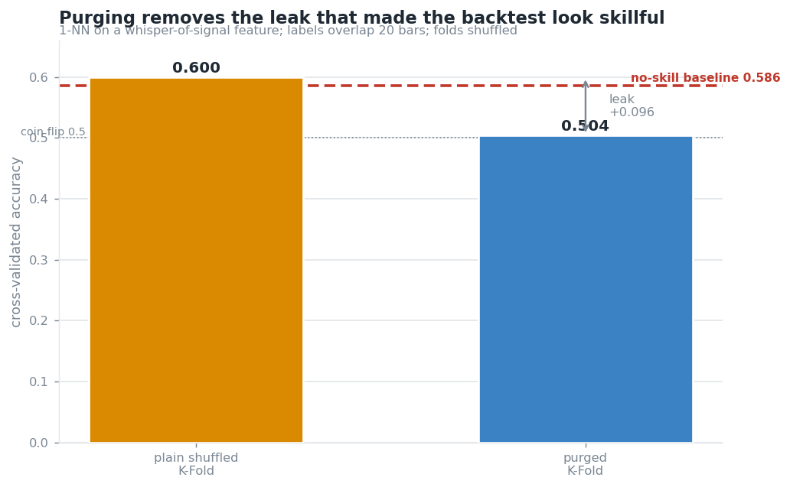
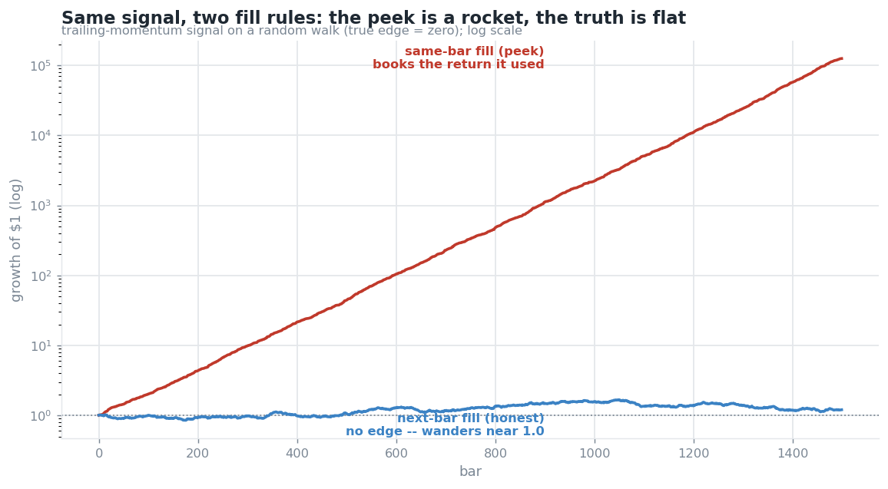
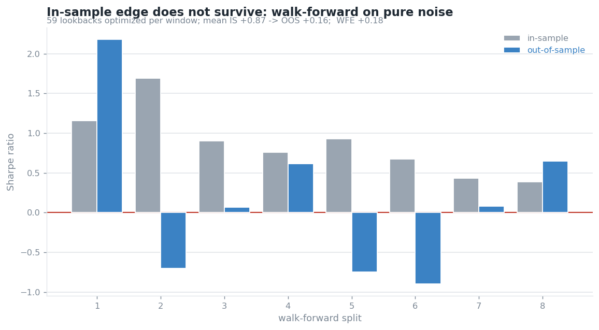

# QuantDesk demos — a backtest that rejects itself

Four self-contained demonstrations of the discipline that separates a real edge from an
artifact. Every one generates synthetic data with a **known** answer (usually zero true
edge), then shows a naive method being fooled and the rigorous method getting it right.

numpy for the logic, matplotlib for the charts. Deterministic (seeded). No market data, no
broker, no scipy — the standard-normal CDF and its inverse are implemented from scratch.
Each demo has a `test_*.py` (plain asserts, run directly) whose headline test encodes the point.

```bash
cd demo
python3 deflated_sharpe_demo.py    && python3 test_deflated_sharpe.py
python3 purged_cv_demo.py          && python3 test_purged_cv.py
python3 lookahead_detector_demo.py && python3 test_lookahead_detector.py
python3 walk_forward_demo.py       && python3 test_walk_forward.py
python3 plot_*.py                  # regenerate the four charts
```

---

## 1. Deflated Sharpe Ratio — correcting for the number of trials

Search 200 strategies over pure noise, keep the highest Sharpe, and you "find" an annualized
Sharpe near 2.0 from zero true edge — purely by selection. The **Probabilistic Sharpe Ratio**
tests one Sharpe against a benchmark but is blind to how many you tried, so it blesses the
lucky winner. The **Deflated Sharpe Ratio** (Bailey & López de Prado, 2014) haircuts the
Sharpe by the trial count, the return distribution's skew/kurtosis, and the sample length.

```
CASE 1  best of 200 PURE-NOISE strategies (true edge = ZERO)
    winner annualized Sharpe : +1.91
    PSR (ignores trials)     :  0.996  -> ACCEPT (WRONG)
    DSR (haircuts trials)    :  0.436  -> REJECT (correct)
CASE 2  a genuine edge, same 200-trial context
    DSR                      :  0.993  -> ACCEPT (correct)
```


The winner is the 99.5th percentile of a zero-edge pile, just short of the DSR benchmark.
DSR discriminates — it rejects the noise winner and still passes a real edge.

## 2. Purged K-Fold — removing the leak that inflates cross-validation

Financial labels span time. If a label is a forward return over the next *h* bars, training
samples next to a test fold share information with it. **Shuffled** k-fold — the common sin —
scatters a test point's time-neighbors into training, and their overlapping labels leak
straight in. **Purge + embargo** drops the overlapping neighbors and restores the truth.

```
majority-class baseline (no skill)  : 0.586
plain  shuffled K-Fold accuracy     : 0.600  <- inflated by leakage
purged shuffled K-Fold accuracy     : 0.504  <- honest, collapses to coin-flip
```



## 3. Lookahead detector — catching a strategy that books the bar it traded on

The classic retail leak is the same-bar fill: a signal from bar *t*'s close, filled at that
same close. On a random walk (zero edge), the cheat prints a **+20 Sharpe** because
`sign(r)·r = |r|` is positive every bar; the honest next-bar fill sits near zero. Two
detectors — a fill-timing audit and a shuffle test — expose it.

```
same-bar fill (cheat)  Sharpe : +20.89   <- absurd; books the return it used
next-bar fill (honest) Sharpe :  +0.28   <- the truth: no edge
favorable gap (the peek)      : +20.61
```



Same signal, two fill rules: the peek grows $1 → $125,000; the truth wanders around $1.

## 4. Walk-forward efficiency — how much in-sample edge survives

Optimize a parameter on a training window, freeze it, trade the next unseen window, roll
forward. **Walk-Forward Efficiency = OOS Sharpe / IS Sharpe.** Near 1 means the edge was
real; near 0 means it was curve-fit. Searching 59 lookbacks on a random walk:

```
mean in-sample Sharpe     : +0.87   <- optimization always finds "edge"
mean out-of-sample Sharpe : +0.16   <- it does not survive
walk-forward efficiency   : +0.18
```



---

## Why these are the pieces worth showing

Together they are the four ways a backtest lies — selection across trials, leakage across
folds, lookahead within a bar, and overfitting across time — each demonstrated on data whose
true edge is zero, so the naive number is provably wrong. They are runnable slices of Phase 1
of a larger system (QuantDesk) whose organizing principle is: *the first deliverable is a
harness that can honestly reject a strategy, not a profitable one.*

## References

- Bailey, D. & López de Prado, M. (2014). *The Deflated Sharpe Ratio.* J. Portfolio Management.
- Bailey, D. & López de Prado, M. (2012). *The Sharpe Ratio Efficient Frontier.* (PSR.)
- López de Prado, M. (2018). *Advances in Financial Machine Learning*, ch. 7 (purged CV, embargo).
