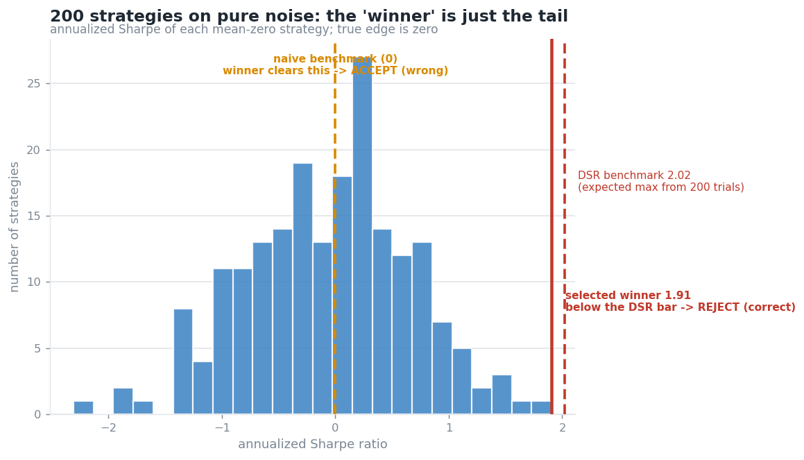
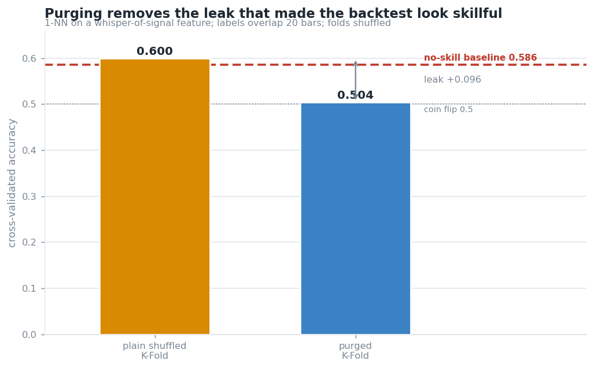
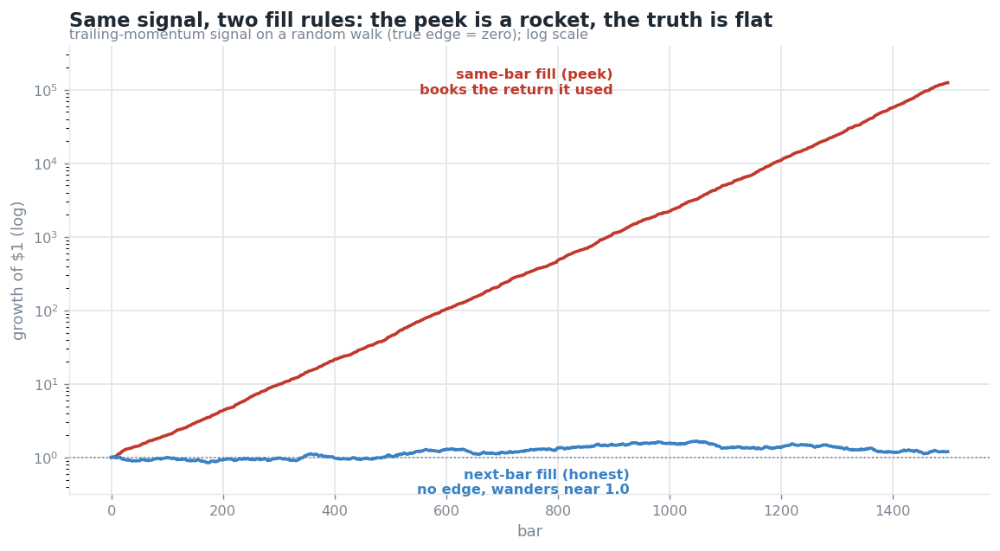
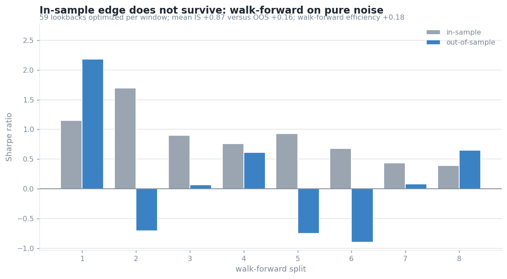
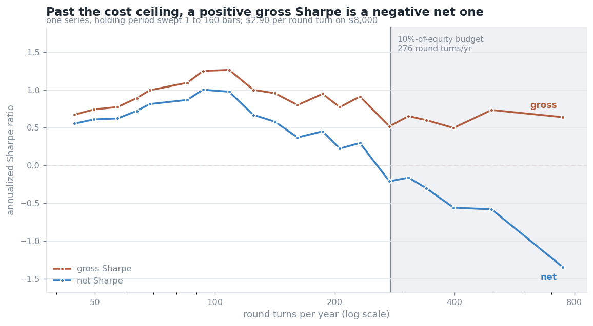

# SignalGuard demos, a backtest that rejects itself

Five self-contained checks, each generating synthetic data with a **known** answer, then
showing a naive method being fooled by it and a corrected method getting it right. In the
first four the true edge is zero and the naive method finds one anyway. In the fifth the
edge is real and the naive method misses that it cannot be traded.

numpy for the logic, matplotlib for the charts. Deterministic (seeded). No market data, no
broker, no scipy, the standard-normal CDF and its inverse are implemented from scratch.
Each demo has a `test_*.py` (plain asserts, run directly) whose headline test encodes the point.

```bash
cd harness
python3 run_all.py                 # every demo + every test + every chart; exits nonzero on any failure
```

or individually:

```bash
python3 gate_demo.py               && python3 test_gate.py          # the unified gate (see below)
python3 deflated_sharpe.py    && python3 test_deflated_sharpe.py
python3 purged_cv.py          && python3 test_purged_cv.py
python3 lookahead_detector.py && python3 test_lookahead_detector.py
python3 walk_forward.py       && python3 test_walk_forward.py
python3 cost_survival.py      && python3 test_cost_survival.py
python3 plot_*.py                  # regenerate the five charts
```

## The gate, all five checks, one verdict

The five checks compose into a single `evaluate(...)` that returns ACCEPT or REJECT with a
reason per check.

```
SignalGuard validation gate
  [FAIL] deflated_sharpe   DSR 0.44 < 0.95  (edge indistinguishable from 200-trial noise)
  [FAIL] lookahead_audit   same-bar/next-bar gap +20.88  (books the bar it traded on)
  [FAIL] purged_cv         purged 0.50 at baseline, leak +0.10  (score was leakage)
  [FAIL] walk_forward      WFE -0.14 < 0.5  (IS +0.91 -> OOS -0.13, edge did not survive)
  [FAIL] cost_survival     net/gross -2.10 < 0.5  (gross +0.64 -> net -1.34, break-even $0.93/RT vs $2.90 paid)
  VERDICT: REJECT (5/5 checks failed)
```

`gate_demo.py` runs it on an overfitting artifact (REJECT, above) and a clean strategy
(ACCEPT). Design rule enforced by `test_gate.py`: **ACCEPT requires at least one check to
have run and none to have failed; a missing input is SKIP and an undefined (nan) score is
FAIL, never a silent PASS.** (`gate.py`, `test_gate.py`.)

---

## 1. Deflated Sharpe Ratio, correcting for the number of trials

Search 200 strategies over pure noise, keep the highest Sharpe, and you "find" an annualized
Sharpe near 2.0 from zero true edge, purely by selection. The **Probabilistic Sharpe Ratio**
tests one Sharpe against a benchmark but is blind to how many you tried, so it blesses the
lucky winner. The **Deflated Sharpe Ratio** (Bailey & López de Prado, 2014) haircuts the
Sharpe by the trial count, the return distribution's skew/kurtosis, and the sample length.

```
CASE 1  best of 200 PURE-NOISE strategies (true edge = ZERO)
    winner annualized Sharpe : +1.91
    PSR (ignores trials)     :  0.996  -> ACCEPT (WRONG)
    DSR (haircuts trials)    :  0.436  -> REJECT (correct)
CASE 2  a genuine edge, same 200-trial context
    DSR                      :  0.993  -> ACCEPT (correct)
```



The winner is the 99.5th percentile of a zero-edge pile, just short of the DSR benchmark.
DSR discriminates, it rejects the noise winner and still passes a real edge.

## 2. Purged K-Fold, removing the leak that inflates cross-validation

Financial labels span time. If a label is a forward return over the next *h* bars, training
samples next to a test fold share information with it. **Shuffled** k-fold, the common sin,
scatters a test point's time-neighbors into training, and their overlapping labels leak
straight in. **Purge + embargo** drops the overlapping neighbors and restores the truth.

```
majority-class baseline (no skill)  : 0.586
plain  shuffled K-Fold accuracy     : 0.600  <- inflated by leakage
purged shuffled K-Fold accuracy     : 0.504  <- honest, collapses to coin-flip
```



## 3. Lookahead detector, catching a strategy that books the bar it traded on

The classic retail leak is the same-bar fill: a signal from bar *t*'s close, filled at that
same close. On a random walk (zero edge), the cheat prints a **+20 Sharpe** because
`sign(r)·r = |r|` is positive every bar; the honest next-bar fill sits near zero. Two
detectors, a fill-timing audit and a shuffle test, expose it.

```
same-bar fill (cheat)  Sharpe : +20.89   <- absurd; books the return it used
next-bar fill (honest) Sharpe :  +0.28   <- the truth: no edge
favorable gap (the peek)      : +20.61
```



Same signal, two fill rules: the peek grows $1 → $125,000; the truth wanders around $1.

## 4. Walk-forward efficiency, how much in-sample edge survives

Optimize a parameter on a training window, freeze it, trade the next unseen window, roll
forward. **Walk-Forward Efficiency = OOS Sharpe / IS Sharpe.** Near 1 means the edge was
real; near 0 means it was curve-fit. Searching 59 lookbacks on a random walk:

```
mean in-sample Sharpe     : +0.87   <- optimization always finds "edge"
mean out-of-sample Sharpe : +0.16   <- it does not survive
walk-forward efficiency   : +0.18
```



## 5. Cost survival, the edge that exists gross and does not exist net

The first four checks ask whether a backtested number is real. This one assumes it is and
asks the next question: **is it big enough to pay for its own turnover?** Costs scale with
how often you trade; edge does not. Past some frequency, a genuine edge is somebody else's
commission revenue.

One price series carrying two real edges, traded at two holding periods:

```
FAST  lookback 1 bar
  gross Sharpe            :   +0.64
  net Sharpe              :   -1.34
  net / gross retention   :   -2.10
  round turns per year    :     747   (2.97/day)
  annual commission bill  :   27.1% of equity
  break-even cost per RT  : $  0.93   vs $2.90 assumed paid

SLOW  lookback 48 bars
  gross Sharpe            :   +1.09
  net Sharpe              :   +0.87
  net / gross retention   :   +0.79
  round turns per year    :      85   (0.34/day)
  annual commission bill  :    3.1% of equity
  break-even cost per RT  : $ 14.02   vs $2.90 assumed paid
```



Both gross Sharpes are ordinary, inside the 0.5 to 1.0 band a retail futures system can
honestly target and nowhere near the ~2.0 that would itself be a defect report. **No other
check in this harness distinguishes them.** The fast variant spends 27% of equity a year on
commissions to harvest an edge worth less than that, and only the retention ratio says so.

Two things about this demo are worth stating plainly:

- **The number it reports is the break-even cost, and that one is measured.** $0.93 and
  $14.02 per round turn come out of the return series and assume no cost figure at all. The
  $2.90 they are compared against is an assumption carried in from private research and is
  still unverified, so the comparison is the soft half and the break-even is the hard half.
- **The obvious version of this demo is not true and is not claimed.** "Trading faster looks
  better gross and dies net" held on one seed out of 40 and vanished on the rest. Choosing
  that seed would have made a cleaner story out of a result that is not there, which is the
  exact failure the other four checks exist to catch.

---

## On real data, 155 years of S&P 500

The synthetic demos prove the checks work against a known answer. `real_data_gate.py` runs
the gate on **cached monthly S&P 500 closes back to 1871** (`data/sp500.csv`, Robert
Shiller's long-run US equity series, published alongside *Irrational Exuberance*,
publicly available with attribution expected) and shows it behaving sensibly on real prices:

```
STRATEGY A  buy-and-hold, full 155y (a priori)
  [PASS] deflated_sharpe   PSR 1.00 (N=1: no selection to deflate)
  [PASS] walk_forward      WFE 0.76  (IS +2.15 -> OOS +1.64)
  VERDICT: ACCEPT

STRATEGY B  best of 153 MA combos on a SHORT 72-month window (overfit trap)
  winner annualized Sharpe +2.02  <- looks great
  [FAIL] deflated_sharpe   DSR 0.91 < 0.95  (indistinguishable from 153-trial noise)
  [FAIL] walk_forward      WFE 0.21  (IS +9.86 -> OOS +2.11, edge did not survive)
  VERDICT: REJECT
```

The lesson is sharper than "reject everything": the real equity premium (buy-and-hold,
chosen a priori) **passes**, while a big parameter search on a small sample **fails**, its
2.0 Sharpe is a small-sample artifact. Overfitting is trials-vs-sample-size, and the gate
feels it on real prices. The same MA search over the *full* 155 years is not flagged; 155
years is enough data to survive the deflation. (`real_data_gate.py`, `test_real_data_gate.py`.)

## Why these are the pieces worth showing

Together they are the five ways a backtest lies, selection across trials, leakage across
folds, lookahead within a bar, overfitting across time, and an edge too small to pay its own
commissions. The first four are demonstrated on data whose true edge is zero, so the naive
number is provably wrong; the fifth on data whose edge is real but unaffordable. They are runnable slices of Phase 1
of a larger system (SignalGuard) whose organizing principle is: *the first deliverable is a
harness that can honestly reject a strategy, not a profitable one.*

## References

- Bailey, D. & López de Prado, M. (2014). *The Deflated Sharpe Ratio.* J. Portfolio Management.
- Bailey, D. & López de Prado, M. (2012). *The Sharpe Ratio Efficient Frontier.* (PSR.)
- López de Prado, M. (2018). *Advances in Financial Machine Learning*, ch. 7 (purged CV, embargo).
